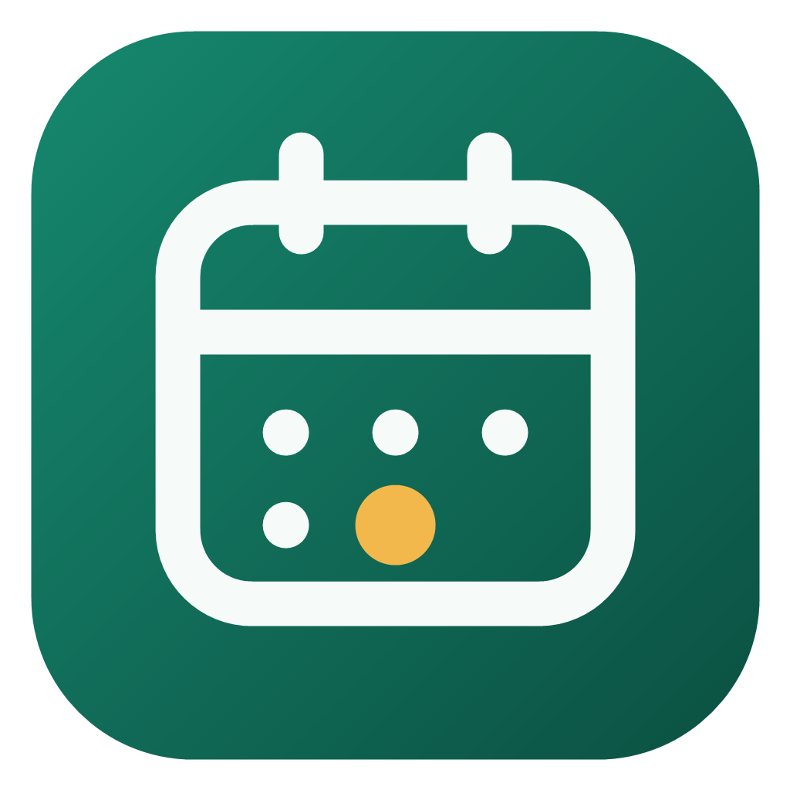

<p align="center"></p>

<h1 align="center">DeskCal</h1>

<p align="center">Google 캘린더와 Google Tasks를 Windows 바탕화면에 붙여 두는 위젯<br>
<a href="https://taekit93.github.io/deskcal/">소개 페이지 · 라이브 데모</a> · <a href="https://github.com/taekit93/deskcal/releases">다운로드</a> · <a href="https://taekit93.github.io/deskcal/privacy.html">개인정보처리방침</a></p>

---

## 기능

- **월간 달력:** 일정이 있는 날을 캘린더 색 점으로 표시하고, 날짜를 누르면 그날 일정을 시간순으로 보여줍니다.
- **할 일 완료 체크:** 체크하면 Google Tasks에 바로 반영되고, 3초 안에 다시 누르면 취소됩니다. Chat 스페이스나 Docs에서 나에게 할당된 할 일도 함께 나옵니다.
- **바탕화면 고정:** 다른 창보다 항상 뒤에 있고, `Win`+`D`로 바탕화면을 보면 나타납니다. 상단 바의 핀 버튼(또는 트레이 메뉴 "위치·크기 고정")으로 위치와 크기를 고정할 수 있습니다.
- **커스터마이징:** 테마 6종, 강조색, 배경 불투명도, 글자 크기, 상단 바 숨기기, 표시 항목 켜고 끄기
- **오프라인:** 연결이 끊기면 마지막으로 받은 데이터를 보여주고, 연결되면 자동으로 새로고침합니다.

## 설치

[Releases](https://github.com/taekit93/deskcal/releases)에서 설치 파일(`.exe`)을 받아 실행한 뒤, 위젯에서 Google 계정으로 로그인합니다. Windows 11 x64에서 동작을 확인했습니다.

- **종료:** 알림 영역의 DeskCal 아이콘을 오른쪽 클릭 → 종료
- **자동 실행 끄기:** 설정(⚙) → 일반 → "Windows 시작 시 자동 실행"
- 앱이 Google 검증을 받기 전에는 로그인할 때 "확인되지 않은 앱" 화면이 나옵니다. **고급 → DeskCal(으)로 이동**을 누르면 계속할 수 있습니다.

## 개인정보

DeskCal에는 서버가 없습니다. 앱은 PC에서 Google API와 직접 통신합니다.
- 로그인 토큰은 Windows 자격 증명 관리자에, 설정과 캐시는 `%APPDATA%\kr.taekit93.gcalwidget\`에 저장됩니다.
- 요청 권한은 `calendar.calendarlist.readonly`(캘린더 목록), `calendar.events.readonly`(일정 읽기), `tasks`(할 일 읽기와 완료 처리) 세 가지입니다.
- 로그아웃하면 Google에 토큰 철회를 요청하고, PC의 토큰과 캐시를 지웁니다.

자세한 내용은 [개인정보처리방침](https://taekit93.github.io/deskcal/privacy.html)을 참고하세요.

## 직접 빌드하기

필요한 것: Node 20+, Rust(stable-msvc), Visual Studio 2022 Build Tools(C++ 데스크톱 워크로드)

1. **Google Cloud에서 OAuth 클라이언트 만들기**
   1. [Google Cloud Console](https://console.cloud.google.com)에서 프로젝트를 만들고 **Google Calendar API**, **Google Tasks API**를 사용 설정합니다.
   2. OAuth 동의 화면을 설정합니다(외부, 스코프 `calendar.calendarlist.readonly`, `calendar.events.readonly`, `tasks`). 테스트 상태로 두면 7일마다 다시 로그인해야 하므로, 본인만 쓸 때도 "앱 게시"를 권장합니다.
   3. 사용자 인증 정보 → OAuth 클라이언트 ID → 애플리케이션 유형 **데스크톱 앱**
2. `.env.example`을 `.env`로 복사하고 클라이언트 ID와 시크릿을 넣습니다. `.env`는 git에 올라가지 않습니다.
3. 빌드와 실행

```bash
npm install
npm run tauri dev            # 개발 실행
npm test                     # 프론트엔드 테스트 (Vitest)
cd src-tauri && cargo test   # 백엔드 테스트
npm run tauri build          # 설치 파일: src-tauri/target/release/bundle/nsis/
npm run build:site           # 소개 페이지 데모 빌드: site/demo/
```

## 구조

| 경로 | 내용 |
|---|---|
| `src-tauri/src/` | Rust 백엔드: OAuth(PKCE), Google API, 캐시, 설정, 트레이, 바탕화면 고정 |
| `src/` | 위젯 화면(TypeScript + Vite): 달력, 할 일, 테마, 설정 |
| `src/demo/`, `demo/` | 소개 페이지용 데모. 같은 화면 코드를 예시 데이터로 실행 |
| `site/` | 소개 페이지와 개인정보처리방침 (GitHub Pages) |
| `docs/` | 설계 문서, 구현 계획, 수동 테스트 체크리스트 |

## 라이선스

[MIT](LICENSE)

Google, Google 캘린더, Google Tasks는 Google LLC의 상표입니다. DeskCal은 Google과 관련이 없는 독립 앱입니다.

---

### English

DeskCal pins your Google Calendar month view and Google Tasks to the Windows desktop. It stays behind your windows, lets you check off tasks in place, and comes with six themes and adjustable opacity. There is no server: the app talks to Google APIs directly from your PC and stores its token in Windows Credential Manager. See the [landing page](https://taekit93.github.io/deskcal/) for a live demo, [Releases](https://github.com/taekit93/deskcal/releases) for the installer, and the steps above to build it yourself with your own OAuth client. Licensed under MIT.
